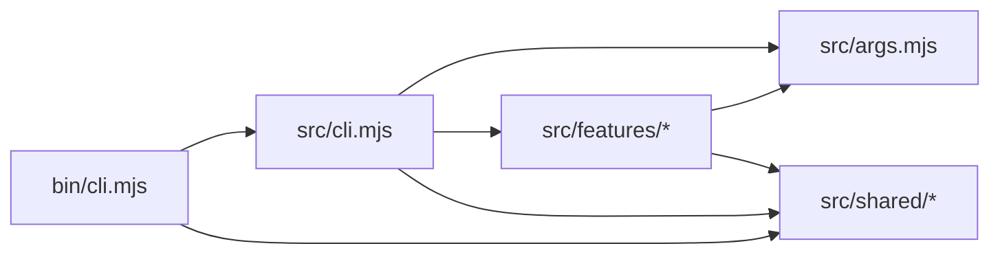
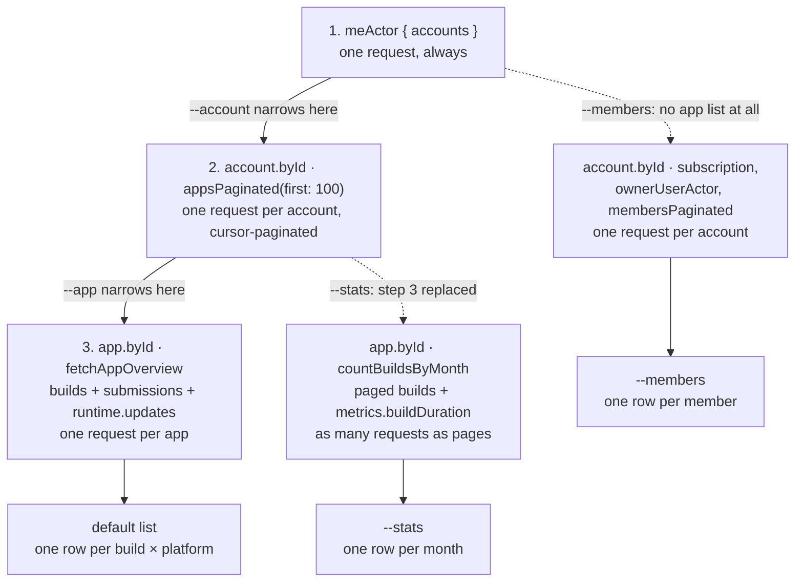

# expo-shelfit architecture

## MUST

- **Imports run one way**: `bin → cli → args / features/* → shared/*`. Never in reverse, never sideways between features.
- **`command.mjs` is the only place that calls `console.*`**; only `bin/cli.mjs` may call `process.exit`.
- **`EXPO_TOKEN` is the only credential** — never from `argv`, never written to disk.
- **Every UTC boundary stays UTC**; `--local` shifts display only.
- **A per-account or per-app failure degrades one row**, it never fails the run.

---

Directory layout is in
[CONTRIBUTING.md#project-layout](../../packages/expo-shelfit/CONTRIBUTING.md#project-layout).
The design decisions below aren't derivable from that tree alone, so they
stay here rather than there.

**Import direction is one-way and enforced by convention, not tooling.** Every arrow below is an import that exists today; the rule is that no others get added. Never in reverse (`shared/api.mjs` must not import from `features/`), and never sideways between features (`features/stats/` must not import from `features/list/`). The picture is loose about two things on purpose: it unions the three features, so an arrow may come from only one of them (`service.mjs → args.mjs` is `--stats` alone, pulling one default constant), and `errors.mjs` is drawn detached because it is importable from anywhere while importing nothing itself.

**No feature imports `shared/api.mjs`** — `src/cli.mjs` builds the client and passes it in. That injection is what lets `service.mjs` be tested against a fake client instead of a mocked `fetch`.

**`command.mjs` is the only place that calls `console.*`.** `service.mjs` fetches and aggregates, returning plain data plus a `warnings` string array, and `format.mjs` turns that data into rows — neither prints.

**`src/*` never calls `process.exit` or reads `process.argv` directly**, so everything stays unit-testable. Only `bin/cli.mjs` is allowed to exit the process — it's the sole place that catches `CliError`/`ApiError` and converts them into a printed message + exit code.

**Auth**: a personal access token in `EXPO_TOKEN` is the only supported credential — never read from `argv`, never written to disk. Missing token throws `CliError` in `resolveAuthHeaders` (`src/cli.mjs`).

**Display modes are mutually exclusive**: `--stats`, `--members`, and `--history` cannot be combined with each other — combining any two is a `CliError`.

**`--usage` is a deprecated alias for `--stats`, `--plan` is a deprecated alias for `--members`** (both removed in the next major). `parseArgs` sets the same `opts.stats`/`opts.members` for each pair and appends `DEPRECATED_USAGE_WARNING`/`DEPRECATED_PLAN_WARNING` to `opts.warnings` rather than printing it, so `parseArgs` stays I/O-free. Error messages echo whichever name was typed (`args.mjs#modeFlag`, keyed by an `aliasFlags` object with one entry per mode that has a deprecated alias), so `--usage --plan` must not report `--stats --members`.

**`--account`/`--app` narrow client-side** (`src/shared/filter.mjs`), at the points marked in the fetch diagram below. Both match slug or EAS Display name (case-insensitive, exact); `--app`'s ambiguity is scoped to one account, so a Display name shared across accounts matches in both. `--app` is incompatible with `--members`, which skips step 2 entirely. No match throws `CliError` with Levenshtein "Did you mean" suggestions.

**`--local` switches which calendar day BUILD/SUBMIT/UPDATE fall on** (`src/shared/dates.mjs#formatBuildDate`, called with `{ time: false }` for all three — the default list no longer shows time-of-day at all). All three columns share one date formatter, so `--local` shifts all three together, never just one. Every UTC boundary (`calendarMonths`, `inclusiveEnd`, `isoDate`) stays UTC unconditionally, since `--stats`'s month bucketing compares them directly against build `createdAt`. Incompatible with `--stats`/`--members`, neither of which has a date column `--local` affects.

**How data is fetched** — all against `https://api.expo.dev/graphql`, concurrency-limited to 8 via `createSemaphore`/`mapWithConcurrency` in `src/shared/concurrency.mjs`:

The narrowing arrows are the point of `--account`/`--app`: both are applied before the step they precede, so a filtered-out account or app never costs a request.

Step 3 (`src/shared/api.mjs#fetchAppOverview`) is where the query shape matters: `builds` is aliased per platform as `<platform>Builds`, with SUBMIT and UPDATE hanging off each build as sub-selections rather than as separate top-level fields, so every row gets its own and the request count is unchanged. `builds` also carries each build's `sdkVersion`/`cliVersion` (the `SDK`/`CLI` columns, always shown, no flag gates them). SUBMIT comes from `Build.submissions`, the reverse of `Submission.submittedBuild`, so it is exactly that build attempt's submission — no client-side matching, and an unsubmitted build shows `-` instead of borrowing a newer build's value. UPDATE has no build to belong to (an OTA targets a *runtime version*), so it comes from `Build.runtime`'s `updates`; a build with a null `runtime` shows `-`. `RuntimeUpdatesFilterInput` accepts only `channel`, so one runtime's page mixes both platforms and `latestRuntimeUpdate` filters on `Update.platform` client-side — hence `first: 10` rather than `first: 1`. That comparison is case-folded on purpose: `Update.platform` is a plain `String!` (`"ios"`) while `Build.platform` is the `AppPlatform` enum (`"IOS"`), and comparing them strictly matches nothing — emptying the UPDATE column for every row with no error to notice, since "no update yet" is a legitimate result. Every response is client-sorted by `createdAt` descending since the API's order is undocumented

`--stats` buckets its paged builds client-side by platform + UTC calendar month (`countBuildsByMonth`, which counts FINISHED/ERRORED/CANCELED and leaves a build in any other status out of every bucket), also summing each build's `metrics.buildDuration` (EAS queue wait deliberately excluded) into the `BUILD MINUTES` column — it does not query billing-scoped fields (`subscription`/`billingPeriod`/ `usageMetrics`), since those are tied to EAS's billing cycle and can't be sliced into arbitrary calendar ranges.

`--members` queries each account in parallel regardless of member count, paginating `membersPaginated` further only when an organization exceeds one page.
`Account.ownerUserActor` is non-null exactly for personal accounts (confirmed against the real API), so `src/features/members/service.mjs` branches on it: a personal account becomes one row (`ORG` "-", `MEMBER`/`ROLE` = the owner), an organization becomes one row per member. A robot member has no `userActor` (only `User` actors get one) and is named via `actor`'s `Robot` inline fragment instead — that fragment is only valid on `actor` (typed `Actor`, the real interface), not on `ownerUserActor` (typed `UserActor`), which errors if a `... on Robot` fragment is added to it.

**`--group-by <account|app>` picks what a `--stats` row counts** (`--stats`-only, default `account`). `app` swaps the ACCOUNT column for APP and makes each (account, app) pair its own group; it adds **no API calls**, since `src/features/stats/service.mjs` already fetched per-app counts and was merely summing them. Two consequences worth keeping: grouping is by pair, so same-named apps in different accounts never merge; and failure gets finer-grained — one app's failed build fetch degrades only its own rows, while an account whose *app list* failed contributes no rows at all and is reported on stderr only.

Per-account/per-app failures don't fail the run: a row still prints with `-` and the reason goes to stderr.
